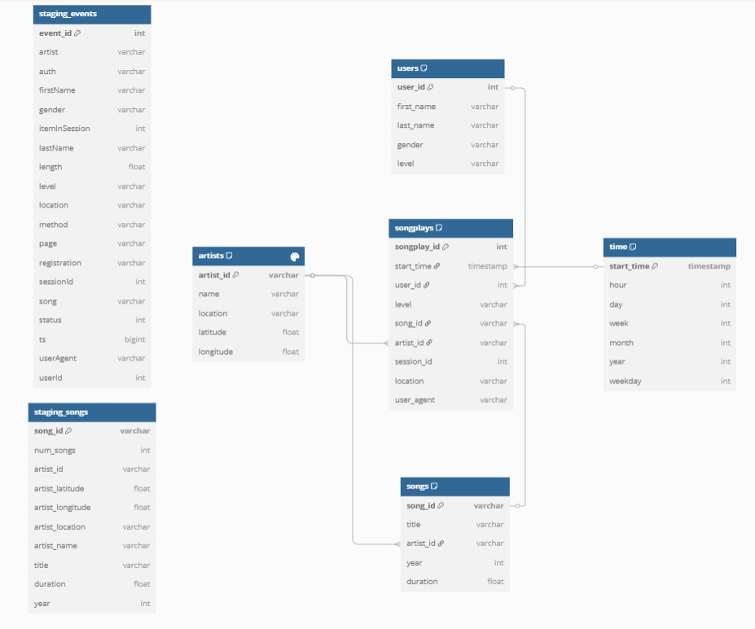

# Projeto de Data Warehouse da Sparkify

## Visão Geral do Projeto
A Sparkify, uma startup de streaming de música, expandiu sua base de usuários e banco de dados de músicas e deseja migrar seus processos e dados para a nuvem. Seus dados estão no S3, em um diretório de logs JSON sobre a atividade dos usuários no aplicativo, bem como em um diretório com metadados JSON sobre as músicas do aplicativo.

Este projeto desenvolve um pipeline ETL que extrai dados do S3, os processa, e os armazena em um conjunto de tabelas dimensionais em um data warehouse Redshift, permitindo que a equipe de análise obtenha insights valiosos sobre quais músicas os usuários estão ouvindo.

## Design do Esquema do Banco de Dados

### Tabelas de Staging
- **staging_events**: Armazena dados brutos de eventos dos arquivos de log
- **staging_songs**: Armazena dados brutos de músicas

### Tabelas Analíticas (Esquema Estrela)

#### Tabela Fato
- **songplays**: Registros associados às reproduções de músicas
  - *songplay_id, start_time, user_id, level, song_id, artist_id, session_id, location, user_agent*

#### Tabelas de Dimensão
- **users**: Usuários no aplicativo
  - *user_id, first_name, last_name, gender, level*
- **songs**: Músicas no banco de dados
  - *song_id, title, artist_id, year, duration*
- **artists**: Artistas no banco de dados
  - *artist_id, name, location, latitude, longitude*
- **time**: Timestamps dos registros em songplays divididos em unidades específicas de tempo
  - *start_time, hour, day, week, month, year, weekday*

  ### Diagrama do Modelo de Dados
  



O diagrama acima ilustra a estrutura do esquema estrela e a relação entre as tabelas:
- A tabela fato `songplays` está no centro, conectada a todas as tabelas de dimensão
- As setas mostram as relações de chave estrangeira entre as tabelas
- As tabelas de staging (`staging_events` e `staging_songs`) alimentam o modelo analítico
- `songplays` filtra apenas eventos onde `page = 'NextSong'`, garantindo que apenas eventos de reprodução de música sejam registrados

### Justificativa do Design do Esquema
Este projeto implementa um esquema estrela otimizado para consultas sobre análise de reprodução de músicas. O esquema inclui:

1. Uma tabela fato centralizada (**songplays**) com foco nas reproduções de músicas pelos usuários
2. Quatro tabelas de dimensão (**users**, **songs**, **artists**, **time**) fornecendo atributos descritivos

Este design oferece os seguintes benefícios:
- Estrutura simples e intuitiva para usuários de negócios
- Agregações rápidas em todas as dimensões
- Eficiência para padrões de consulta conhecidos
- Redução da necessidade de joins complexos
- Desempenho otimizado com chaves de distribuição e ordenação do Redshift

## Pipeline ETL

O pipeline ETL agora segue uma abordagem mais eficiente e robusta:

1. Carrega configurações do arquivo `dwh.cfg` usando a função utilitária `get_config()`
2. Exibe informações detalhadas sobre os arquivos S3 disponíveis para processamento
3. Processa arquivos de música individualmente, extraindo dados para as tabelas `songs` e `artists`
4. Processa arquivos de log individualmente, extraindo dados para as tabelas `time`, `users` e `songplays` 
5. Fornece feedback em tempo real sobre o progresso do processamento, incluindo métricas de desempenho

## Arquivos do Projeto

- **utils.py**: Módulo central com funções utilitárias compartilhadas entre os scripts
- **sql_queries.py**: Contém todas as consultas SQL usadas no processo ETL e análises, agora usando dicionários para melhor organização
- **create_tables.py**: Cria as tabelas do banco de dados com feedback detalhado
- **etl.py**: Implementa o processo ETL com processamento de arquivo individual e monitoramento
- **list_s3_files.py**: Ferramenta interativa para explorar arquivos do S3 com informações detalhadas
- **run_analytics.py**: Executa consultas analíticas predefinidas usando o dicionário de consultas
- **dwh.cfg**: Arquivo de configuração para credenciais AWS e caminhos de arquivos S3
- **requirements.txt**: Lista de dependências necessárias para executar o projeto

## Consultas Analíticas

O projeto agora utiliza um dicionário para organizar as consultas analíticas, proporcionando:

1. **Melhor Organização**: Cada consulta está associada diretamente ao seu nome descritivo
2. **Manutenção Simplificada**: Facilidade para adicionar, remover ou modificar consultas
3. **Código Mais Limpo**: Eliminação da necessidade de listas separadas para consultas e seus nomes

Consultas analíticas disponíveis:
- **Top 10 Músicas Mais Populares**: Identifica as músicas com maior número de reproduções
- **Atividade do Usuário por Hora do Dia**: Analisa o padrão de uso ao longo do dia
- **Distribuição de Usuários Gratuitos vs. Pagos**: Compara o número de usuários em cada nível de assinatura
- **Top 5 Localizações por Contagem de Usuários**: Identifica as regiões com mais usuários
- **Usuários Mais Ativos**: Lista os usuários que mais ouvem músicas
- **Reproduções de Músicas por Dia da Semana**: Analisa o padrão de uso ao longo da semana

## Melhorias na Estrutura do Código

O projeto foi completamente refatorado para:

1. **Modularidade Aprimorada**: Centralização de código comum em módulo utilitário
2. **Redução de Redundância**: Eliminação de funções duplicadas em diferentes arquivos
3. **Padronização**: Estilo consistente de código e tratamento de erros
4. **Estruturas de Dados Otimizadas**: Uso de dicionários para melhor organização das consultas
5. **Feedback Aprimorado**: Informações detalhadas sobre o progresso e desempenho
6. **Interatividade**: Ferramentas auxiliares com interfaces mais amigáveis

## Como Executar

1. Instale as dependências:
   ```
   pip install -r requirements.txt
   ```

2. Configure suas credenciais AWS no arquivo `dwh.cfg`

3. Crie as tabelas do banco de dados:
   ```
   python create_tables.py
   ```

4. Execute o processo ETL completo:
   ```
   python etl.py
   ```

5. Explore os arquivos no bucket S3 (interface interativa):
   ```
   python list_s3_files.py
   ```

6. Execute consultas analíticas predefinidas:
   ```
   python run_analytics.py
   ```

## Ferramentas de Monitoramento

O projeto inclui recursos avançados de monitoramento para o processo ETL:

- **Visibilidade de Arquivos S3**: Estatísticas detalhadas sobre os arquivos sendo processados
- **Indicadores de Progresso**: Acompanhamento em tempo real das etapas do ETL
- **Métricas de Desempenho**: Tempo de execução para cada operação principal
- **Amostragem de Dados**: Visualização prévia dos dados para verificação rápida
- **Formatação Aprimorada**: Apresentação profissional dos resultados de consultas